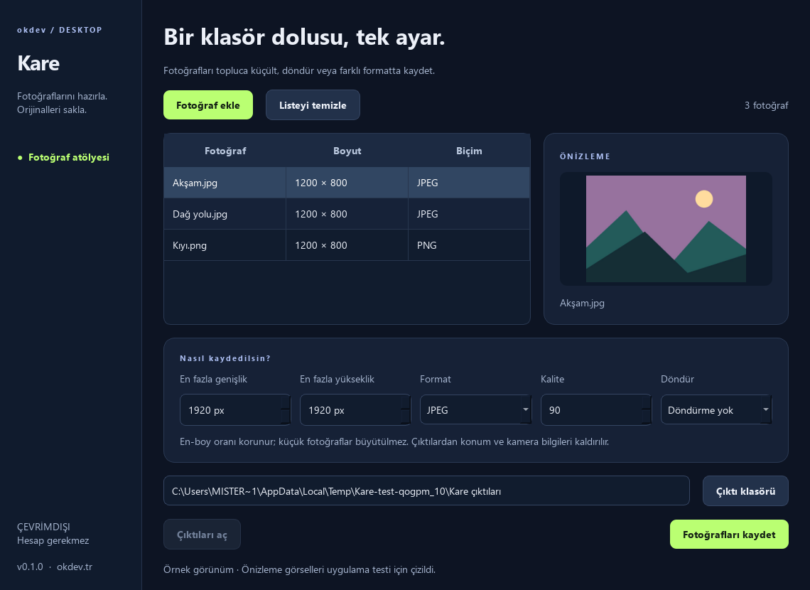

# Kare

**Bir klasör dolusu fotoğraf, tek ayar.** Türkçe toplu fotoğraf hazırlama uygulaması.

[Windows için indir](https://github.com/okdev01/kare/releases/download/v0.1.0/Kare-0.1.0-Windows-x64.zip) · [Tüm sürümler](https://github.com/okdev01/kare/releases) · [English summary](#english)



## Kullanım

1. ZIP'in tamamını bir klasöre çıkar ve **Kare.exe** dosyasını aç.
2. **Fotoğraf ekle** ile bir veya birden çok dosya seç.
3. En fazla genişlik/yükseklik, çıktı formatı ve gerekiyorsa döndürme ayarını belirle.
4. Kaynaklardan **farklı bir çıktı klasörü** seç.
5. **Fotoğrafları kaydet** düğmesine bas. Sonuçları **Çıktıları aç** ile görüntüle.

Python veya internet gerekmez. `_internal` klasörünü EXE'nin yanında tut.

## Özellikler

- JPEG, PNG, WebP, BMP ve tek sayfalı TIFF girişi.
- JPEG, PNG veya WebP çıktısı; JPEG/WebP kalite ayarı.
- En-boy oranını koruyan küçültme; küçük görselleri büyütmez.
- 90°, 180° ve 270° döndürme; EXIF yön bilgisini görüntüye uygular.
- Orijinal dosyaları değiştirmeden ayrı klasöre kayıt.
- Çakışmada numaralı dosya adı; mevcut çıktının üzerine yazmaz.
- Çıktıda kaynak EXIF/GPS/kamera metadatasını taşımaz.
- Bozuk bir dosya olduğunda diğer fotoğraflarla devam eder.

JPEG'e dönüşümde şeffaf alanlar beyazla doldurulur. PNG/WebP şeffaflığı korur.
Görselin içine yazılmış metinler veya kişisel bilgiler kaldırılmaz.

## Sınırlar

Bir seferde en fazla 200 fotoğraf seçilir; fotoğraflar sırayla işlenir. 40 megapiksel
üzeri kaynaklar, animasyonlar, çok sayfalı görüntüler, RAW ve HEIC desteklenmez.
İşlem sırasında pencereyi kapatmak yerine tamamlanmasını bekleyin; bu sürümde
parti ortasında iptal yoktur. ICC renk profilleri korunmaz; renk doğruluğu kritik
profesyonel baskı işlerinde kullanılmadan önce sonuç kontrol edilmelidir.

Çıktı boyutu bir üst sınırdır, kırpma yapılmaz. Süre görüntü boyutuna ve formatına
bağlıdır. Ağ isteği veya telemetri yoktur. Windows x64 paketi kod imzalı değildir.

## Geliştirme

```powershell
python -m venv .venv
.\.venv\Scripts\python -m pip install -r requirements-build.txt
.\.venv\Scripts\python main.py
.\.venv\Scripts\python -m unittest -v
.\.venv\Scripts\python main.py --smoke-test smoke-result.json --preview preview.png
.\.venv\Scripts\python build.py
```

Python 3.14, Qt/PySide6 ve Pillow. Dokuz test; oran, alfa, döndürme, EXIF,
çakışma, orijinalin korunması ve bozuk/animasyonlu dosyaları kapsar. Arayüz ve
EXE kontrolü, geçici klasörde oluşturulan örnek görsellerle yapılır.

## English

A Turkish Windows batch photo tool for resizing, rotating and converting images.
Exports into a separate folder, strips source metadata and never overwrites
existing files. Offline; no account or Python installation needed for the ZIP build.

MIT · [Orçun Kara / okdev](https://okdev.tr). [Dependency notices](THIRD_PARTY_NOTICES.txt).
